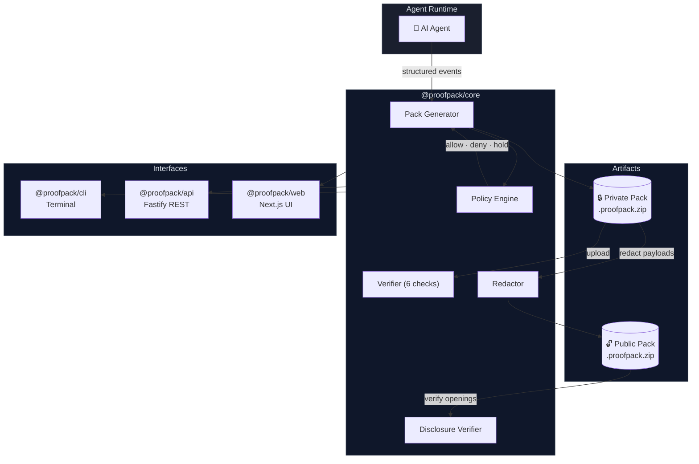
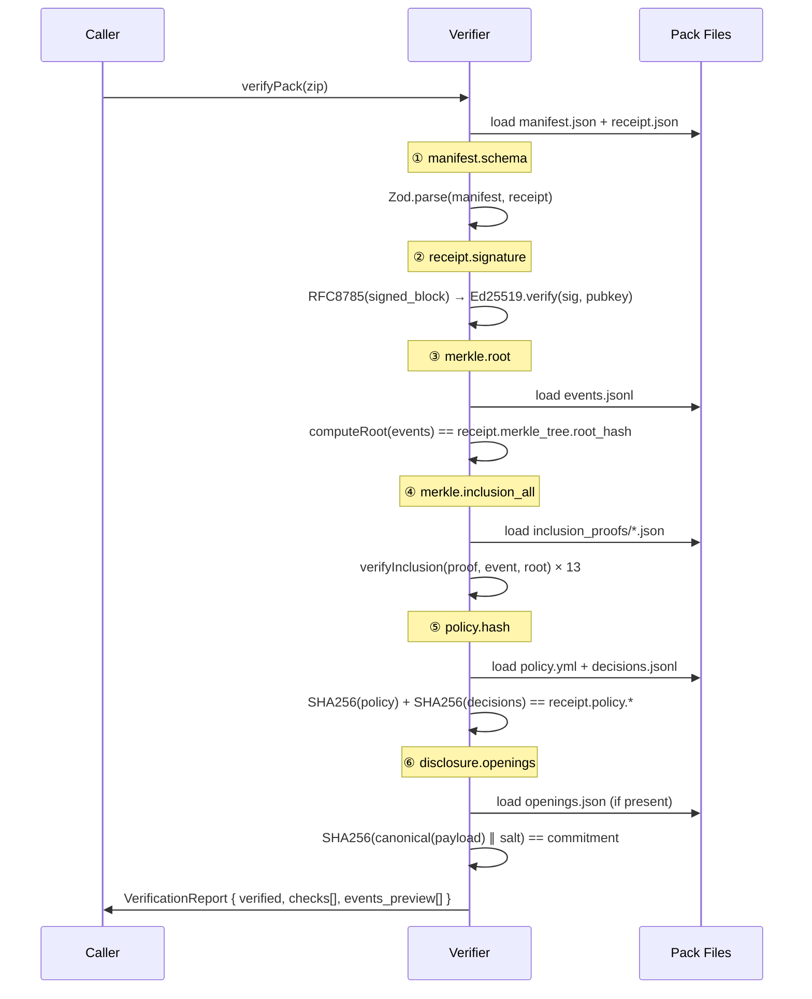
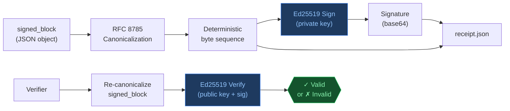
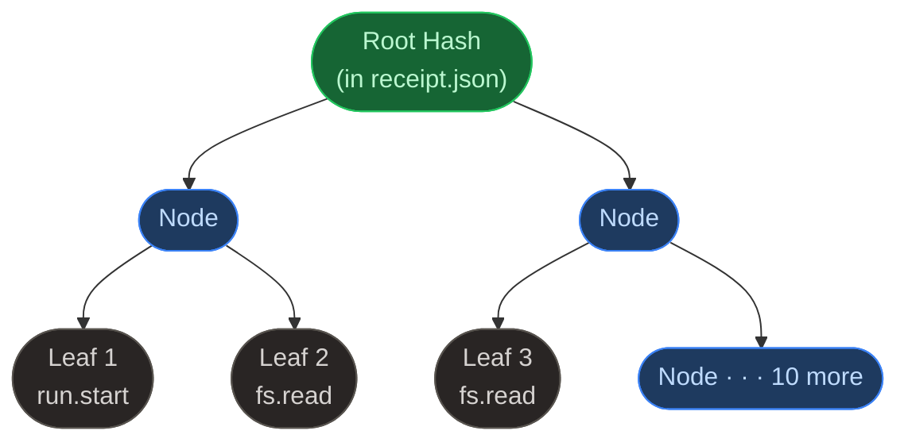
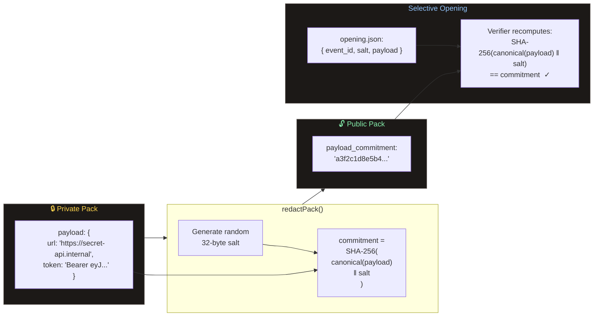

<div align="center">

<pre>
██████╗ ██████╗  ██████╗  ██████╗ ███████╗██████╗  █████╗  ██████╗██╗  ██╗
██╔══██╗██╔══██╗██╔═══██╗██╔═══██╗██╔════╝██╔══██╗██╔══██╗██╔════╝██║ ██╔╝
██████╔╝██████╔╝██║   ██║██║   ██║█████╗  ██████╔╝███████║██║     █████╔╝
██╔═══╝ ██╔══██╗██║   ██║██║   ██║██╔══╝  ██╔═══╝ ██╔══██║██║     ██╔═██╗
██║     ██║  ██║╚██████╔╝╚██████╔╝██║     ██║     ██║  ██║╚██████╗██║  ██╗
╚═╝     ╚═╝  ╚═╝ ╚═════╝  ╚═════╝ ╚═╝     ╚═╝     ╚═╝  ╚═╝ ╚═════╝╚═╝  ╚═╝
</pre>

**Verifiable receipts for AI agent runs**

*Cryptographically signed · Merkle-audited · Policy-enforced · Offline-verifiable*

[](https://www.typescriptlang.org/)
[](./packages)
[](./tests/e2e)
[](https://nextjs.org/)
[](https://pnpm.io/)

</div>

---

## Table of Contents

- [What is ProofPack?](#-what-is-proofpack)
- [The Problem](#-the-problem)
- [How It Works](#-how-it-works)
- [Quick Start](#-quick-start)
- [Architecture](#-architecture)
- [The ProofPack Format](#-the-proofpack-format)
- [Verification Pipeline](#-verification-pipeline)
- [Cryptographic Design](#-cryptographic-design)
- [Selective Disclosure](#-selective-disclosure)
- [Web UI](#-web-ui)
- [CLI Reference](#-cli-reference)
- [API Reference](#-api-reference)
- [Project Structure](#-project-structure)
- [Tech Stack](#-tech-stack)
- [Testing](#-testing)
- [Contributing](#-contributing)

---

## What is ProofPack?

ProofPack turns an AI agent run into a **portable, tamper-evident artifact** — a signed bundle containing every action the agent took, every policy decision that was applied, and a cryptographic proof linking them all together.

Think of it like the **flight data recorder** for your AI stack. When an agent reads a file, calls a tool, executes a shell command, or makes a network request, ProofPack captures that event, hashes it, weaves it into an unforgeable Merkle audit log, and signs the whole thing with an Ed25519 key. The result is a `.proofpack` bundle that anyone can verify — offline, without trusting ProofPack itself.

No black boxes. No "trust me, the AI did the right thing." **Cryptographic proof or it didn't happen.**

---

## The Problem

AI agents are increasingly autonomous. They read your codebase, write files, call APIs, execute shell commands, and make decisions that affect real systems. Yet today there is **no standard way to answer the most important questions about an agent run**:

- *What exactly did the agent do, in what order, with what inputs and outputs?*
- *Was the agent operating within its approved policy when it did those things?*
- *Has this audit log been tampered with since it was produced?*
- *Can I share evidence of what happened without revealing sensitive payload data?*

Logs can be deleted. Databases can be edited. `STDOUT` scrolls away. Even well-intentioned systems leave no cryptographic trail that an independent third party could verify.

ProofPack closes this gap.

---

## How It Works

```
    AI Agent Runtime
         │
         │ emits structured events
         ▼
  ┌─────────────────┐
  │  ProofPack Core │   ← applies policy, builds Merkle tree, signs receipt
  └────────┬────────┘
           │ produces
           ▼
  ┌──────────────────────────┐
  │    .proofpack bundle     │
  │  ┌──────────────────┐   │
  │  │   manifest.json  │   │  ← SHA-256 fingerprints of every component
  │  │   receipt.json   │   │  ← Ed25519 signature over the entire run
  │  │   events.jsonl   │   │  ← every action, in order, RFC 8785 canonical
  │  │   policy.yml     │   │  ← rules that governed the run
  │  │   decisions.jsonl│   │  ← per-event policy verdict (allow/deny/hold)
  │  │   merkle.json    │   │  ← Merkle tree root and structure
  │  │   inclusion_proofs/  │  ← per-event inclusion proofs
  │  └──────────────────┘   │
  └────────────┬─────────────┘
               │  anyone can verify
               ▼
  ┌─────────────────────────┐
  │      Verifier           │   ← 6 independent cryptographic checks
  │   ✓ manifest.schema     │
  │   ✓ receipt.signature   │
  │   ✓ merkle.root         │
  │   ✓ merkle.inclusion_all│
  │   ✓ policy.hash         │
  │   ✓ disclosure.openings │
  └─────────────────────────┘
```

Verification is **entirely offline**. No network calls. No ProofPack servers. The math either checks out or it doesn't.

---

## Quick Start

### Prerequisites

| Tool | Version | Install |
|------|---------|---------|
| Node.js | ≥ 20 | [nodejs.org](https://nodejs.org) |
| pnpm | ≥ 9 | `npm i -g pnpm` |

### Install

```bash
git clone https://github.com/your-username/proofpack
cd proofpack
pnpm install
```

### Generate a Demo Pack

```bash
pnpm demo
```

```
Generating demo ProofPack...
✓ events/events.jsonl      (13 events)
✓ policy/policy.yml
✓ policy/decisions.jsonl   (13 decisions)
✓ audit/merkle.json
✓ audit/inclusion_proofs/  (13 proofs)
✓ receipt.json             Ed25519 signed
✓ manifest.json

────────────────────────────────────────
Done! Verify with:
  pnpm verify -- examples/sample_runs/latest.proofpack
```

### Verify the Pack

```bash
pnpm verify -- examples/sample_runs/latest.proofpack
```

```
ProofPack Verification Report
────────────────────────────────────────
Run ID:     d3e0baa5-de10-4000-a000-000000000000
Created:    2026-01-15T10:00:00.000Z
Producer:   proofpack-demo v0.1.0

  ✓  manifest.schema          Schema valid
  ✓  receipt.signature        Ed25519 verified (key: xj2WIj96...)
  ✓  merkle.root              Root matches (13 events)
  ✓  merkle.inclusion_all     All 13 proofs valid
  ✓  policy.hash              Hashes match
  ✓  disclosure.openings      No openings (private pack)

VERIFIED (6/6 checks passed)

13 events in log
```

### Launch the Web UI

```bash
pnpm dev
```

Open [http://localhost:3000](http://localhost:3000) and click **Try demo pack** — the full verification flow runs in your browser.

---

## Architecture



The system is a **TypeScript monorepo** with four packages sharing a single core library:

| Package | Role |
|---------|------|
| `@proofpack/core` | Cryptography, pack generation, verification, policy engine, redaction |
| `@proofpack/cli` | `pnpm demo` and `pnpm verify` terminal commands |
| `@proofpack/api` | Fastify REST server (local dev, CLI tooling) |
| `@proofpack/web` | Next.js 15 web application (7 screens, dark UI) |

---

## The ProofPack Format

A ProofPack bundle is a plain `.zip` archive with a deterministic directory structure:

```
.proofpack/
├── manifest.json               ← SHA-256 fingerprints of every component below
├── receipt.json                ← Ed25519 signature over the entire run
│
├── events/
│   └── events.jsonl            ← one canonical JSON object per line
│
├── policy/
│   ├── policy.yml              ← YAML rules that governed this run
│   └── decisions.jsonl         ← per-event verdict (allow · deny · hold)
│
└── audit/
    ├── merkle.json             ← tree metadata (size, root hash)
    └── inclusion_proofs/
        ├── {event_id_1}.json   ← sibling-hash proof for event 1
        ├── {event_id_2}.json   ← sibling-hash proof for event 2
        └── ...                 ← one per event
```

**After redaction** (selective disclosure), an additional directory appears:

```
.proofpack/
└── disclosure/
    └── openings.json           ← { event_id, salt_b64, payload } for revealed events
```

### Key Files Explained

<details>
<summary><strong>receipt.json</strong> — the root of trust</summary>

```json
{
  "signed_block": {
    "schema_version": "0.1.0",
    "run_id": "d3e0baa5-de10-4000-a000-000000000000",
    "created_at": "2026-01-15T10:00:00.000Z",
    "producer": { "name": "proofpack-demo", "version": "0.1.0" },
    "merkle_tree": {
      "tree_size": 13,
      "root_hash": "a3f2c1..."
    },
    "policy": {
      "policy_sha256": "b4e8d2...",
      "decisions_sha256": "c9f3a1..."
    },
    "artifact": {
      "manifest_sha256": ""
    }
  },
  "signature": {
    "alg": "Ed25519",
    "public_key": "xj2WIj96...",
    "sig": "MEQCIBz...",
    "canonicalization": "RFC8785",
    "hash": "SHA-256"
  }
}
```

The `signed_block` is serialized with **RFC 8785 JSON Canonicalization** before signing, ensuring the same bytes are produced regardless of key ordering or whitespace.
</details>

<details>
<summary><strong>events.jsonl</strong> — the audit log</summary>

```jsonl
{"event_id":"d3e0baa5-0001-...","ts":"2026-01-15T10:00:00.000Z","type":"run.start","actor":"proofpack-demo-agent","payload":{"model":"gpt-4o","session":"demo-session-01"}}
{"event_id":"d3e0baa5-0002-...","ts":"2026-01-15T10:00:01.000Z","type":"fs.read","actor":"proofpack-demo-agent","payload":{"path":"workspace/config.json"}}
{"event_id":"d3e0baa5-000a-...","ts":"2026-01-15T10:00:14.000Z","type":"net.http","actor":"proofpack-demo-agent","payload":{"url":"https://api.example.com/data","method":"GET"}}
```

Each line is a **complete event** with a UUID, ISO-8601 timestamp, type, actor, and structured payload.
</details>

<details>
<summary><strong>policy.yml</strong> — the rules that governed the run</summary>

```yaml
version: "0.1"
defaults:
  decision: deny      # default-deny: anything not explicitly allowed is blocked

rules:
  - id: allow_read_workspace
    when: { event_type: fs.read, path_glob: "workspace/**" }
    decision: allow
    severity: low
    reason: "Allow reading files inside workspace"

  - id: hold_shell_exec
    when: { event_type: shell.exec }
    decision: hold
    severity: medium
    reason: "Shell commands require human approval"

  - id: deny_network
    when: { event_type: net.http }
    decision: deny
    severity: high
    reason: "Network access is not allowed"
```
</details>

---

## Verification Pipeline

When you call `verifyPack()`, six independent checks run in sequence. **Every single check must pass** for `verified: true`.



### The Six Checks

| # | Check | What it proves |
|---|-------|----------------|
| 1 | `manifest.schema` | The bundle is structurally valid; all required files are present and well-formed |
| 2 | `receipt.signature` | The signed block was produced by the private key corresponding to the stated public key — and has not been altered since |
| 3 | `merkle.root` | The event log has not been modified, reordered, or truncated since signing |
| 4 | `merkle.inclusion_all` | Each individual event is genuinely part of the signed tree — no events were inserted |
| 5 | `policy.hash` | The policy rules and the per-event decisions have not been changed since signing |
| 6 | `disclosure.openings` | Each revealed payload actually corresponds to its commitment hash |

---

## Cryptographic Design

### Ed25519 Signatures



[RFC 8785](https://www.rfc-editor.org/rfc/rfc8785) (JSON Canonicalization Scheme) ensures that the same JSON object always produces the **identical byte sequence** regardless of how it was constructed or serialized. Without this, an attacker could re-order keys or change whitespace to produce a different byte sequence for the same logical content.

[Ed25519](https://ed25519.cr.yp.to/) was chosen for its small key sizes (32 bytes), fast verification, and strong security properties. Implementation: [`@noble/ed25519`](https://github.com/paulmillr/noble-ed25519) — a production-audited, pure-TypeScript library with zero dependencies.

### RFC 6962 Merkle Tree



Each event is hashed as a **leaf**: `SHA-256(0x00 ‖ canonicalize(event))`

Each internal node is: `SHA-256(0x01 ‖ left_child ‖ right_child)`

The `0x00` / `0x01` domain separation (from RFC 6962) prevents **second pre-image attacks** where an internal node hash could be mistaken for a leaf hash.

An **inclusion proof** for an event contains only the sibling hashes needed to reconstruct the root. With 13 events, each proof is at most 4 hashes (⌈log₂ 13⌉ = 4 levels). Verification: recompute root from leaf → compare to signed root. If they match, the event is genuine.

---

## Selective Disclosure

By default, a ProofPack bundle is **private** — all event payloads are stored in full. ProofPack also supports generating a **public pack** where payloads are removed but their cryptographic commitments remain. The Merkle tree stays valid; the agent's actions are provable without revealing the contents.



**The commitment scheme guarantees:**

- The public pack verifies with the same 6 checks as the private pack
- Anyone can verify a revealed payload by recomputing the hash
- Unrevealed payloads remain completely hidden — no information leaks from the commitment alone
- The salt prevents rainbow table attacks on short or predictable payloads

---

## Web UI

ProofPack ships with a dark-first Next.js web application. Load a pack by dragging a `.zip` onto the drop zone or clicking **Try demo pack** — then explore every aspect of the run across seven screens.

### Screen Map

```
/verify ──────────────────────────────────────────── Drag & Drop
   │
   └──▶ /report ──────────────────────────────────── Verification Result
           │  Animated 6-check reveal (250ms stagger)
           │  VERIFIED / NOT VERIFIED status chip
           │  Tamper simulator (split-view comparison)
           │
           ├──▶ /timeline ──────────────────────────── Event Log
           │       │  Virtualized list (scales to 100k+ events)
           │       │  Filter by type, decision, free-text search
           │       └─ Click any event → JSON drawer
           │
           ├──▶ /proofs ────────────────────────────── Cryptographic Proofs
           │       │  Ed25519 signature details
           │       └─ Interactive Merkle tree SVG
           │          (click leaf → animate proof path to root)
           │
           ├──▶ /policy ────────────────────────────── Policy & Decisions
           │       │  Rules list with match criteria
           │       └─ Decisions table (filterable by outcome)
           │
           ├──▶ /disclosure ─────────────────────────── Selective Disclosure
           │       │  Private ↔ Public mode toggle
           │       └─ Generate + re-verify public pack in-browser
           │
           └──▶ /export ─────────────────────────────── Export
                   │  Verification report (JSON)
                   │  Original pack download
                   │  Public pack download
                   └─ Evidence bundle
```

### Key Features

- **Command palette** — Press `/` from any screen to jump anywhere instantly
- **Tamper simulator** — Modify the receipt in-browser and watch the signature check fail in real time
- **Interactive Merkle tree** — Click any leaf to animate the inclusion proof path from leaf to root
- **Animated verification** — Each check reveals with a staggered animation, building trust visually
- **Virtualized timeline** — Handles tens of thousands of events without performance degradation
- **Offline-capable** — All verification runs client-side in WebAssembly + pure TypeScript; no backend calls for verification

---

## CLI Reference

### `pnpm demo`

Generate a complete 13-event demo pack with a deterministic keypair and fixed `run_id`. The pack is written to `packages/cli/examples/sample_runs/latest.proofpack/`.

**The 13 demo events cover every major event type and policy outcome:**

| # | Type | Payload | Policy Decision |
|---|------|---------|----------------|
| 1 | `run.start` | `model: gpt-4o` | — |
| 2 | `fs.read` | `workspace/config.json` | allow |
| 3 | `fs.read` | `workspace/src/index.ts` | allow |
| 4 | `fs.read` | `workspace/../secrets.env` | deny |
| 5 | `tool.call` | `list_dir workspace/` | allow |
| 6 | `shell.exec` | `grep -r TODO workspace/` | hold |
| 7 | `hold.request` | Approval prompt | — |
| 8 | `hold.approve` | Approved by human | — |
| 9 | `shell.exec` | `grep -r TODO workspace/` *(post-approval)* | allow |
| 10 | `net.http` | `https://api.example.com/data` | **deny** |
| 11 | `fs.write` | `workspace/out/report.md` | allow |
| 12 | `fs.write` | `workspace/out/summary.json` | allow |
| 13 | `run.end` | `exit_code: 0` | — |

### `pnpm verify -- <path>`

Verify any `.proofpack/` directory or `.proofpack.zip` file. Exits `0` if verified, `1` if not.

```bash
# Verify a directory
pnpm verify -- path/to/run.proofpack

# Verify a zip
pnpm verify -- path/to/run.proofpack.zip
```

---

## API Reference

The Fastify REST API (`apps/api`, default port `5000`) exposes three endpoints.

### `GET /api/demo-pack`

Download the pre-generated demo ProofPack as a zip file.

**Response:** `application/zip` — `demo.proofpack.zip`

---

### `POST /api/verify`

Upload a `.proofpack.zip` and receive a full verification report.

**Request:** `multipart/form-data` with field `file`

**Response `200`:**

```json
{
  "ok": true,
  "summary": {
    "verified": true,
    "run_id": "d3e0baa5-de10-4000-a000-000000000000",
    "created_at": "2026-01-15T10:00:00.000Z",
    "producer": { "name": "proofpack-demo", "version": "0.1.0" }
  },
  "checks": [
    { "name": "manifest.schema",      "ok": true, "details": {} },
    { "name": "receipt.signature",    "ok": true, "details": { "public_key": "xj2W..." } },
    { "name": "merkle.root",          "ok": true, "details": { "tree_size": 13 } },
    { "name": "merkle.inclusion_all", "ok": true, "details": { "verified_events": 13 } },
    { "name": "policy.hash",          "ok": true, "details": {} },
    { "name": "disclosure.openings",  "ok": true, "details": { "skipped": true } }
  ],
  "events_preview": [
    { "event_id": "d3e0baa5-0001-...", "ts": "...", "type": "run.start", "summary": "Agent start: model=gpt-4o" },
    { "event_id": "d3e0baa5-000a-...", "ts": "...", "type": "net.http",  "summary": "GET https://api.example.com/data", "decision": "deny" }
  ]
}
```

**Error responses:**

| Status | Code | Description |
|--------|------|-------------|
| 400 | `NO_FILE` | No file attached to the request |
| 400 | `ZIP_SLIP` | Zip contains path traversal (`../`) — rejected for security |
| 400 | `INVALID_PACK` | Archive is missing required files |
| 413 | — | File exceeds 50 MB limit |

---

### `POST /api/redact`

Upload a private `.proofpack.zip`, strip all event payloads, and return a public pack where each event carries only a cryptographic commitment.

**Request:** `multipart/form-data` with field `file`

**Response `200`:** `application/zip` — `public.proofpack.zip`

The public pack passes all six verification checks. Sharing it reveals nothing about payload contents.

---

## Project Structure

```
proofpack/
├── package.json                  ← root scripts: dev, test, e2e, check, demo, verify
├── pnpm-workspace.yaml
├── tsconfig.base.json            ← strict TypeScript (no any, strict: true)
├── eslint.config.mjs             ← typescript-eslint flat config
├── vitest.workspace.ts           ← unified test runner across all packages
├── playwright.config.ts          ← E2E: Chromium, baseURL localhost:3000
│
├── packages/
│   ├── core/                     ← @proofpack/core
│   │   └── src/
│   │       ├── crypto/
│   │       │   ├── hash.ts       ← SHA-256, leaf/node hashing (0x00/0x01 prefix)
│   │       │   ├── canonical.ts  ← RFC 8785 canonicalization wrapper
│   │       │   ├── ed25519.ts    ← sign, verify, generateKeypair
│   │       │   └── merkle.ts     ← buildTree, computeRoot, inclusionProof, verifyInclusion
│   │       ├── types/            ← Zod schemas: Event, Manifest, Receipt, Policy, Decision
│   │       ├── policy/
│   │       │   └── engine.ts     ← evaluateEvent: top-to-bottom, first-match-wins, default-deny
│   │       └── pack/
│   │           ├── generator.ts  ← generatePack: full pipeline
│   │           ├── verifier.ts   ← verifyPack: 6 checks
│   │           ├── loader.ts     ← loadPack with zip-slip protection
│   │           ├── redactor.ts   ← redactPack: remove payloads, add commitments
│   │           └── disclosure.ts ← verifyOpenings: validate selective disclosures
│   │
│   └── cli/                      ← @proofpack/cli
│       └── src/
│           ├── commands/
│           │   ├── demo.ts       ← generate 13-event demo pack
│           │   └── verify.ts     ← verify pack, print report, exit 0/1
│           └── demo/
│               ├── events.ts     ← 13 deterministic demo events
│               ├── keypair.ts    ← fixed-seed Ed25519 keypair for reproducibility
│               └── policy.ts     ← demo policy (YAML)
│
├── apps/
│   ├── api/                      ← @proofpack/api (Fastify, port 5000)
│   │   └── src/
│   │       ├── server.ts         ← buildServer() factory (testable)
│   │       └── routes/
│   │           ├── verify.ts     ← POST /api/verify
│   │           ├── redact.ts     ← POST /api/redact
│   │           └── demo.ts       ← GET /api/demo-pack
│   │
│   └── web/                      ← @proofpack/web (Next.js 15, port 3000)
│       └── src/
│           ├── app/
│           │   ├── layout.tsx    ← dark theme, left rail nav, command palette
│           │   ├── api/          ← Next.js API routes (verify, redact, demo-pack)
│           │   ├── verify/       ← drag-drop upload screen
│           │   ├── report/       ← animated checks, tamper simulator
│           │   ├── timeline/     ← virtualized event list + drawer
│           │   ├── proofs/       ← signature detail, interactive Merkle SVG
│           │   ├── policy/       ← rules + decisions table
│           │   ├── disclosure/   ← private/public toggle, openings flow
│           │   └── export/       ← export options
│           ├── components/       ← React component library
│           └── lib/
│               ├── store.ts      ← Zustand: pack, report, events, actions
│               └── api.ts        ← typed fetch wrappers
│
└── tests/
    └── e2e/                      ← Playwright E2E (12 tests)
        ├── demo-flow.spec.ts     ← full verify → report → timeline → export flow
        ├── timeline.spec.ts      ← filter, search, event count
        ├── disclosure.spec.ts    ← toggle, generate public pack, verify
        └── command-palette.spec.ts
```

---

## Tech Stack

### Why These Libraries?

| Area | Library | Reason |
|------|---------|--------|
| **Ed25519** | `@noble/ed25519` v2 | Audited, pure TypeScript, isomorphic (Node + browser), zero native deps |
| **SHA-256** | `@noble/hashes` | Same audit family as ed25519; consistent API |
| **JSON Canon.** | `canonicalize` | Reference implementation of RFC 8785 |
| **Validation** | `zod` | Runtime schema validation at all trust boundaries |
| **Policy YAML** | `js-yaml` + `micromatch` | Battle-tested YAML parser; safe glob matching |
| **Zip I/O** | `yauzl` + `archiver` | Streaming zip with zip-slip protection |
| **HTTP API** | `fastify` v5 | TypeScript-native, `inject()` for testing, built-in multipart |
| **UI Framework** | `next.js` 15 | App Router, React 19, server components, Vercel-native |
| **State** | `zustand` | Minimal cross-screen state without prop drilling |
| **Styling** | `tailwindcss` v4 | Utility-first; CSS variables for dark theme |
| **Event List** | `@tanstack/react-virtual` | Handles 100k+ rows without DOM bloat |
| **Cmd Palette** | `cmdk` | The same component library used by Vercel, Linear, etc. |
| **Unit Tests** | `vitest` | Fast, ESM-native, monorepo-aware workspace runner |
| **E2E Tests** | `playwright` | Reliable cross-browser automation with trace-on-retry |

### Security Choices

| Decision | Detail |
|----------|--------|
| **Default-deny policy** | Unless a rule explicitly allows an action, it is denied |
| **Zip-slip protection** | Every archive entry is validated; `../` paths throw before extraction |
| **No circular hashing** | `artifact.manifest_sha256` is empty in the signed block to avoid a circular dependency |
| **Salt per payload** | Random 32-byte salt prevents rainbow table attacks on redacted payloads |
| **RFC 8785 canonicalization** | Deterministic serialization closes key-reordering attacks |

---

## Testing

### Unit Tests — 171 tests across 13 files

```bash
pnpm test
```

| File | What it covers |
|------|---------------|
| `hash.test.ts` | SHA-256, leaf/node hash with known-answer vectors |
| `canonical.test.ts` | RFC 8785 test vectors (numbers, unicode, key ordering) |
| `ed25519.test.ts` | Sign→verify round-trip; bad sig; mutated message |
| `merkle.test.ts` | Trees of 1, 2, 3, 7, 8, 13 leaves; inclusion proof round-trips |
| `schemas.test.ts` | Zod accepts valid shapes; rejects malformed input |
| `verifier.test.ts` | Golden fixture → all 6 checks pass |
| `policy.test.ts` | Demo policy classifies all 13 event types correctly |
| `redactor.test.ts` | Redacted pack removes payloads; commitments verify |
| `disclosure.test.ts` | Correct opening validates; wrong salt fails |
| `demo.test.ts` | Generate pack → load → verify → all checks pass |
| `verify.test.ts` | Golden fixture → exit 0; tampered → exit 1 |
| API route tests | Fastify inject: verify, redact, demo endpoints |

### E2E Tests — 12 tests across 4 files

```bash
pnpm e2e
```

| File | What it covers |
|------|---------------|
| `demo-flow.spec.ts` | Try demo pack → VERIFIED → Timeline → Proofs → Policy → Export |
| `timeline.spec.ts` | 13 events visible; filter by decision; search by type |
| `disclosure.spec.ts` | Toggle private→public; generate public pack; re-verify |
| `command-palette.spec.ts` | `/` opens palette; navigate to Timeline; `Esc` closes |

### Quality Gates

```bash
pnpm check     # TypeScript strict + ESLint + Prettier — must be clean
pnpm test      # All 171 unit tests
pnpm e2e       # All 12 E2E tests (starts dev server automatically)
```

---

## Contributing

ProofPack is a focused research project. Contributions that stay within scope are welcome.

### Setup

```bash
git clone https://github.com/your-username/proofpack
cd proofpack
pnpm install
pnpm dev        # API on :5000, web on :3000
```

### Before Opening a PR

```bash
pnpm check     # zero warnings
pnpm test      # 171 passing
pnpm e2e       # 12 passing
```

### What's In Scope

- Bug fixes with regression tests
- New event types and policy matchers
- Improved Merkle proof formats (e.g., consistency proofs)
- Additional verification checks (e.g., timestamp ordering)
- UI improvements to existing screens

### What's Out of Scope

- Switching cryptographic primitives (Ed25519 and SHA-256 are intentional)
- Adding a database or centralized verification service (offline is a feature)
- Breaking changes to the pack format without a schema version bump

### Commit Style

[Conventional Commits](https://www.conventionalcommits.org/) — imperative mood, explain *why* not *what*.

```
feat(core): add consistency proof support for append-only streams
fix(verifier): handle packs with zero policy rules
test(e2e): add upload-flow spec for non-demo packs
```

---

## See Also

- [docs/ARCHITECTURE.md](./docs/ARCHITECTURE.md) — Deep technical architecture and design decisions
- [docs/SECURITY.md](./docs/SECURITY.md) — Security model, threat model, and responsible disclosure
- [docs/CONTRIBUTING.md](./CONTRIBUTING.md) — Full contribution guide

---

<div align="center">

*Built with precision. Verified with math.*

</div>

---

<sub>**Disclaimer:** This is a personal research and passion project developed independently in my own time, outside of work hours, using personal equipment. It is not affiliated with, sponsored by, or related to my employer in any way. All opinions, designs, and code are my own.</sub>
